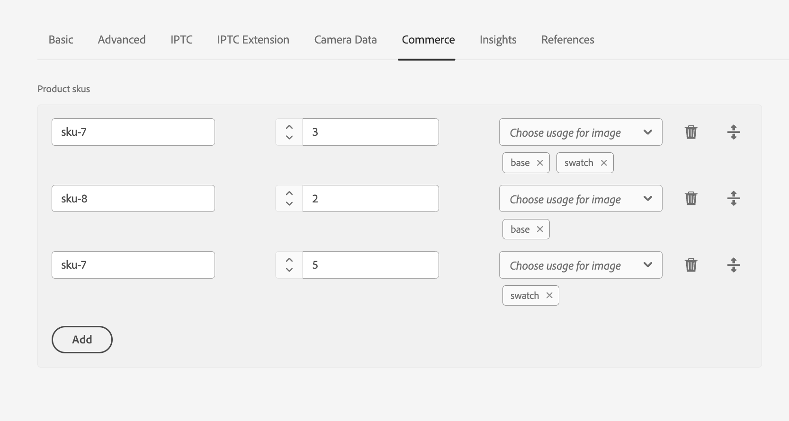

# assets-commerce

This project contains the AEM Commerce boilerplate artifacts. It demonstrates the usage of [Product SKU metadata field](https://github.com/amalhotr_adobe/assets-commerce/tree/main/ui.apps/src/main/content/jcr_root/apps/commerce/ui/components/productdata) for Adobe Experience Manager (AEM). It is intended as a best-practice set of examples as well as a potential starting point to develop your own functionality.

General overview of an AEM project for cloud services is available [here](https://experienceleague.adobe.com/en/docs/experience-manager-cloud-service/content/implementing/developing/aem-project-content-package-structure).

## Modules

The main parts of the template are:

* ui.apps: contains the product data metadata field, a corresponding metadataschema formbuilder component, and overlay of a few ootb formbuilder components. Also contains a RepositoryInitializer config to register a new namespace
* ui.content: contains sample 'default' metadata form with a commerce tab

## How to build

To build all the modules, run in the project root directory the following command with Maven 3:

    mvn clean install

This will build only the artefacts for an AEM as a Cloud Service target. To install the content pkg onto local aem cloud service sdk

    mvn clean install content-package:install
